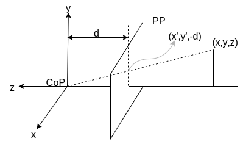

## Modeling projection

Pin-hole model approximation

**CoP**: Center of projection  
**PP**: Projection plan

Put the optical center (CoP) at the origin, which is also the origin of the camera coordinate system.
* The camera looks down the negative Z coordinates.
* The distance between the CoP and PP is **positive**.

## Projection equations

Compare the intersection with perspective projectiom of ray from (x,y,z) to COP.

Derived from using similar triangles.

\rightarrow(-d\frac{x}{z},-d\frac{y}{z},-d))

To retrieve the image location, throw out the last coordinate:

\rightarrow(-d\frac{x}{z},-d\frac{y}{z}))

Distant objects are smaller  
Zero is the center of the image 

## Homogeneous coordinates

Trick: add one more coordinate to the vector:

\Rightarrow\quad\begin{bmatrix}x\\y\\1\end{bmatrix})

\Rightarrow\quad\begin{bmatrix}x\\y\\z\\1\end{bmatrix})

### Convert from homogeneous coordinates

)

)

## Perspective projection

Projection is a matrix multiply using homogeneous coordinates:

\Rightarrow(u,v))

**f** is the focal length, the distance from the center of projection to the image.

### Scaling the projection matrix

)

## Geometric properties of projections

* Points go to points
* Lines go to lines
* Polygons go to poygons

[img ex 3a-L2 lec 8]

## Parallel lines

Parallel lines in the world meet in the image.

Line in 3 space

=x_{0}+at)  
=y_{0}+bt)  
=z_{0}+ct)

Perspective projection of the line

=f\frac{x}{z}=\frac{f(x_0+at)}{z_o+ct})

=f\frac{y}{z}=\frac{f(y_0+bt)}{z_o+ct})

In the limit as , for 

\rightarrow\frac{fa}{c},y'(t)\rightarrow\frac{fb}{c})

Parallel lines in the world will converge to a single point.

## Vanish points

Sets of parallel lines on the plane lead to colinear vanish points. This line is called the "horizon" for the plane.
(Show samples)

## Other types of projections

Orthographic projection

x,y,z => (x,y)

Weak perspective

(x,y,z) => (fx/z0, fy/z0)